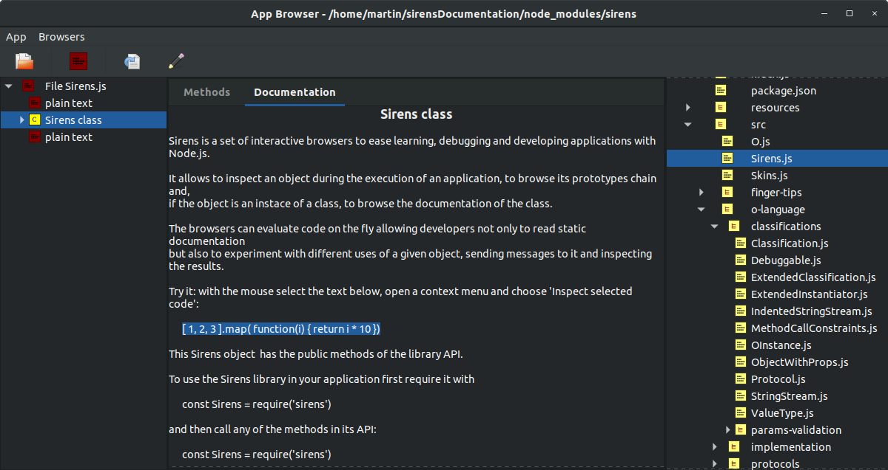
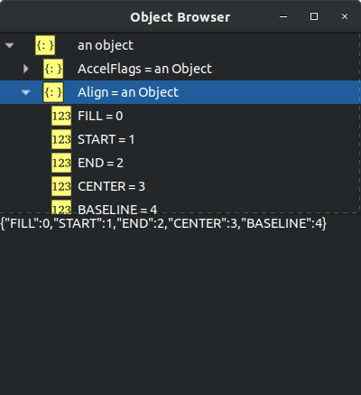
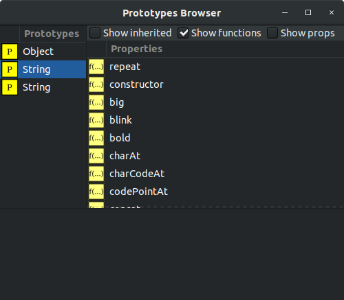
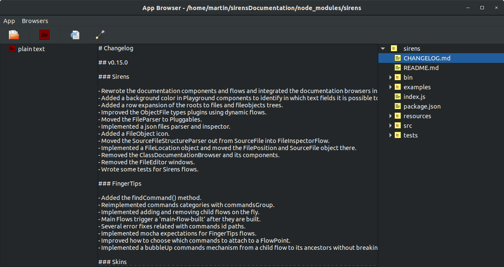
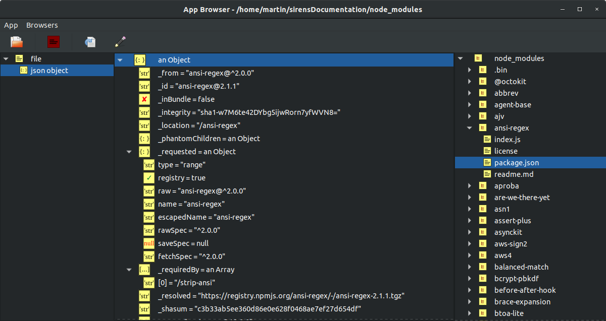
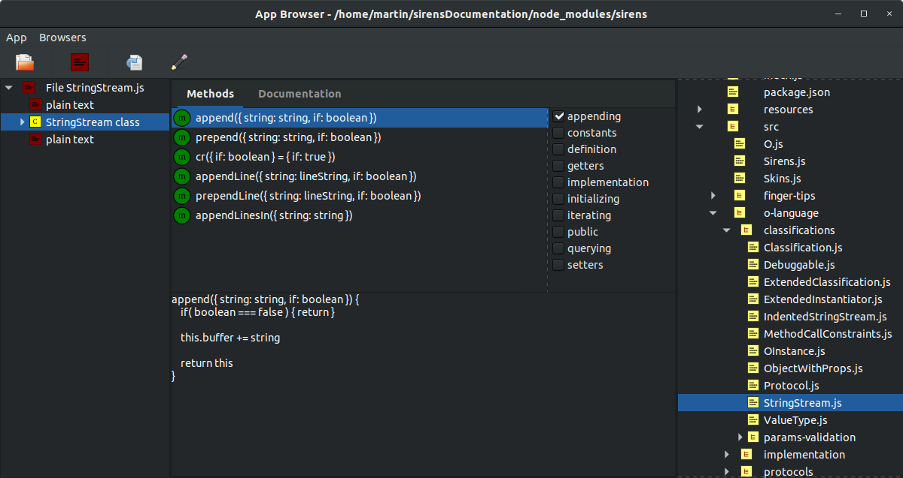
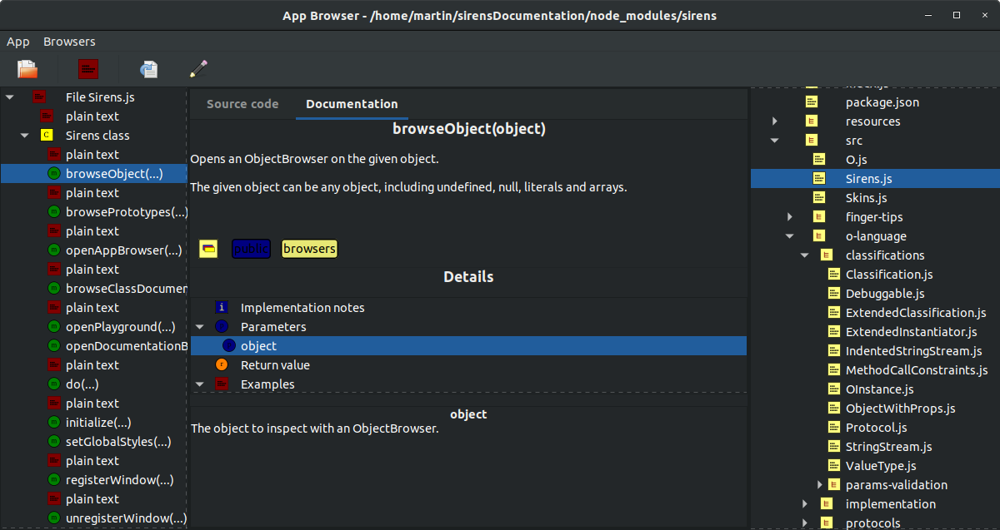
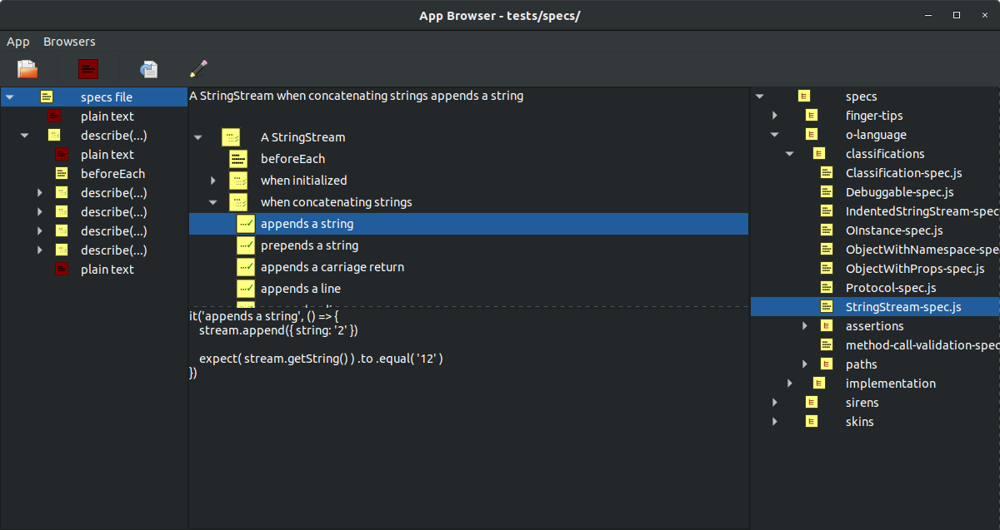

# Note

This project is discontinued for technical reasons, and I will not update it nor maintain it any more. I won't delete the repository in case somebody can take something useful from it

The intention was to have a set of development utilities to make the experience of writing programs pleasant and fun, but the technology of my choice was not the right one for that matter

Gtk+ proved to be too low level, too complex, too error prone and too bound to its Python implementation to be a good choice for me

I don't want to just write programs. I also want to write them in a clean object oriented way and to have a pleasant experience while I do and with Gtk+ that simply was not the case

I will continue to look for alternatives better suited for me to continue with these developments

**2020-12 update**

A yet not fully stable new project related to what Sirens was can be found in this [project](https://bitbucket.org/haijin-development/pm/src/development/)
The name's temporary. It runs in plain JS, no other binaries than node and a browser are required

# Sirens

[](https://travis-ci.org/haijin-development/node-sirens)

Sirens gives Node.js developers some simple and interactive utilities to ease development, testing, debugging and learning Node.

These utilities are written in Node and use GTK3 through [node-gtk](https://www.npmjs.com/package/node-gtk) as its GUI support.

**Note: this project is usable but it is still at an early stage of development.**

**Note: The current version opens with node v12 but it is not stable. See the [pre-requisites](./README.md#pre-requisites) section.**

**Update: checkout FingerTips design documentation in [this article](./docs/FingerTips.pdf) (updated in v0.15.0).**



Next release:

[](https://travis-ci.org/haijin-development/node-sirens)

### Installation

**Note: please keep in mind that this project is not meant for production but only as an utility to be used during development.**

Add `Sirens` to your project with

```
npm install sirens --save-dev
```

or install it globally with

```
npm install sirens -g
```

### Usage

Require the `sirens` module and open a browser on any object with

```javascript
require('sirens').browseObject(object)
```

or

```javascript

const Sirens = require('sirens')

Sirens.browseObject(object)
```

Open a browser on any object properties and methods along its prototypes chain with

```javascript
require('sirens').browsePrototypes(object)
```

or

```javascript
const Sirens = require('sirens')

Sirens.browsePrototypes(object)
```

A Playground is a text editor where you can select, evaluate and inspect snippets of javascript code using the Sirens ObjectBrowser with the same access to the npm modules that your application has.

Think of it as a javascript console in 3 dimensions.

Open a Playground with

```javascript
const Sirens = require('sirens')

Sirens.openPlayground()
```

An AppBrowser lets you browse the files in a selected folder.

In all cases it shows the contents of the file and for some type of files it also opens a specific browser.

For instance, with .js classes and methods it will open a browser on its documentation.
With .json and .yml files it opens a browser on its structure.

Open an AppBrowser with

```javascript
const Sirens = require('sirens')

Sirens.openAppBrowser()
```

### Sirens command line

If you install `Sirens` globally

```
npm install sirens -g
```

you can open a javascript Playground from the command line with:

```
playground [javascript-filename.js]
```

and a javascript AppBrowser from the command line with:

```
appBrowser [folder]
```

If you install `Sirens` in the scope of a project with

```
npm install sirens --save-dev
```

you can open a javascript Playground from the project folder with

```
./node_modules/.bin/playground [javascript-filename.js]
```

and a javascript AppBrowser from the project folder with

```
./node_modules/.bin/appBrowser [folder]
```

### Screenshots

**Browsing an object**



**Browsing prototypes**



**Browsing text files**



**Browsing json files**



**Browsing class methods**



**Browsing class documentation**


**Browsing method documentation**



**Browsing tests**



### Pre-requisites

The current version works only with node <= v11.

```
nvm install v10
```

Please refer to the installation section of [node-gtk](https://www.npmjs.com/package/node-gtk#installing-and-building).

## Semantic versioning

Sirens release model follows the [Semantic Versioning 2.0.0](https://semver.org/) convention.

However please note that:

- Currently Sirens [public API](https://semver.org/#spec-item-1) is the one declared in this document [Usage](./README.md/#usage) section.

- Sirens is still in [version 0.y.z](https://semver.org/#spec-item-4), meaning that all of its interfaces and protocols, including the public ones, are likely to keep changing quite often.

The [O language](https://github.com/haijin-development/o-language/blob/development/README.md) and the [Skins](./src/skins) GUI builder used by Sirens browsers will be released as standalone libraries once they reach a stable public interface. This will happen once there are several new releases of Sirens with no modifications neither in the o-language nor in Skins public interfaces.

## Development

### Running the tests

Run the tests with 

```
npm test
```

### Running the examples

Run the browser and GTK widgets examples from the directory `examples/`.

For example

```
node examples/widgets/checkBox.js
```

```
node examples/browsers/objectBrowser.js
```

## References

These utilities are based in the Smalltalk language browsers, in particular in the [Object Arts](https://www.object-arts.com/)
implementation named [Dolphin Smalltalk](https://github.com/dolphinsmalltalk/Dolphin) which I fancy for its
outstanding beauty, and it's an independent port of [Sirens for the Ruby language](https://github.com/haijin-development/ruby-sirens).

The graphics code is encapsulated in the Skins `views` layer and it should be possible to switch to any other graphics library, be it GTK+ or QT, implementing that layer alone.
