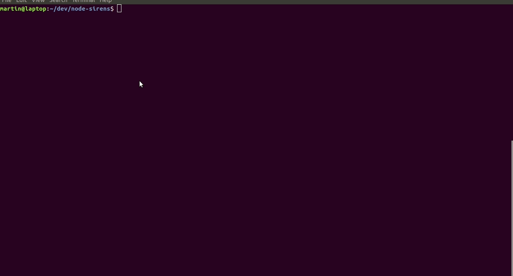
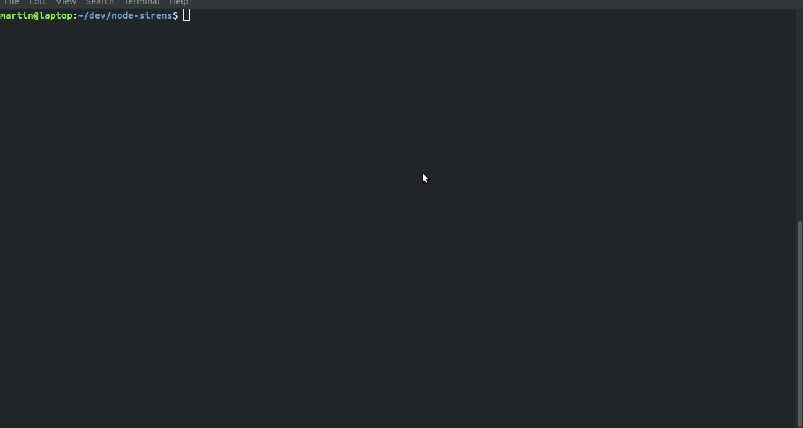

# Sirens

[](https://travis-ci.org/haijin-development/node-sirens)

Sirens gives Node.js developers some simple and interactive utilities to ease development, testing, debugging and learning Node.

These utilities are written in Node and use GTK3 through [node-gtk](https://www.npmjs.com/package/node-gtk) as its GUI support.

**Note: this project is usable but it is still at an early stage of development.**



Next release:

[](https://travis-ci.org/haijin-development/node-sirens)

### Installation

**Note: please keep in mind that this project is not meant for production but only as an utility to be used during development**

Add `Sirens` to your project with

```
npm install sirens --save-dev
```

or install it globally with

```
npm install sirens -g
```

### Usage

Require the `sirens` module and open a browser on any object with

```javascript
const Sirens = require('sirens')

Sirens.browseObject(object)
```

Open a browser on any object properties and methods along its prototypes chain with

```javascript
const Sirens = require('sirens')

Sirens.browsePrototypes(object)
```

Open a browser on the stack call with

```javascript
const Sirens = require('sirens')

Sirens.browseStack(arguments)
```

Open a class editor with

```javascript
const Sirens = require('sirens')

Sirens.openClassEditor()
```

### ClassEditor command line

If you install `Sirens` globally

```
npm install sirens -g
```

you can open a javascript ClassEditor from the command line with:

```
classEditor [javascript-filename.js]
```

If you install `Sirens` in the scope of a project with

```
npm install sirens --save-dev
```

you can open a javascript ClassEditor from the project folder with

```
node_modules/.bin/classEditor [javascript-filename.js]
```

### Screenshots





### Pre-requisites

The current version does not work with node > v10.

```
nvm install v10
```

Please refer to the installation section of [node-gtk](https://www.npmjs.com/package/node-gtk#installing-and-building).


In Ubuntu installing the [following libraries](./.travis.yml#L10)

```
sudo apt install libgtk-3-dev libgirepository1.0-dev gobject-introspection build-essential
```

should be enough to run [node-gtk](https://www.npmjs.com/package/node-gtk#installing-and-building) and `sirens`.


## Semantic versioning

Sirens release model follows the [Semantic Versioning 2.0.0](https://semver.org/) convention.

However please note that:

- Currently Sirens [public API](https://semver.org/#spec-item-1) is the one declared in this document [Usage](./README.md/#usage) section.

- Sirens is still in [verion 0.y.z](https://semver.org/#spec-item-4), meaning that all of its interfaces and protocols, including the public ones, are likely to keep changing quite often.

The [o-language](https://github.com/haijin-development/o-language/blob/development/README.md) and the [gui builder](./src/gui) used by Sirens browsers will be released as standalone libraries once they reach a estable public interface. This will happen once there are several new releases of Sirens with no modifications neither in the o-language nor in its gui builder public interfaces.

## Development

### Running the tests

Run the tests with 

```
npm test
```

### Running the examples

Run the browser and GTK widgets examples from the directory `examples/`.

For example

```
node examples/widgets/checkBox.js
```

```
node examples/browsers/objectBrowser.js
```

## References

These utilities are heavily based in the Smalltalk browsers, in particular in the [Object Arts](https://www.object-arts.com/)
implementation named [Dolphin Smalltalk](https://github.com/dolphinsmalltalk/Dolphin) which I fancy for its
outstanding beauty, and it's an independent port of [Sirens for the Ruby language](https://github.com/haijin-development/ruby-sirens).

The graphics code is encapsulated in the `views` layer and it should be possible to switch to any other graphics library, be it GTK+ or QT, implementing that layer alone.
